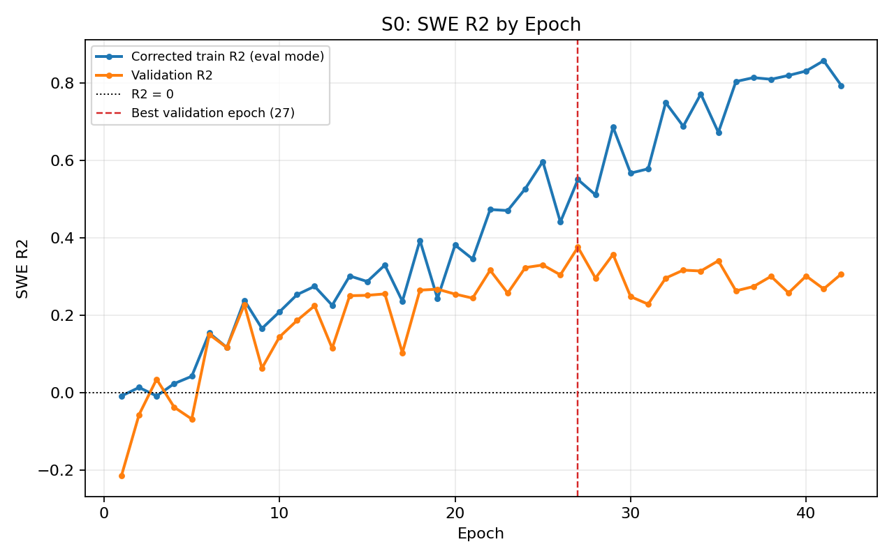
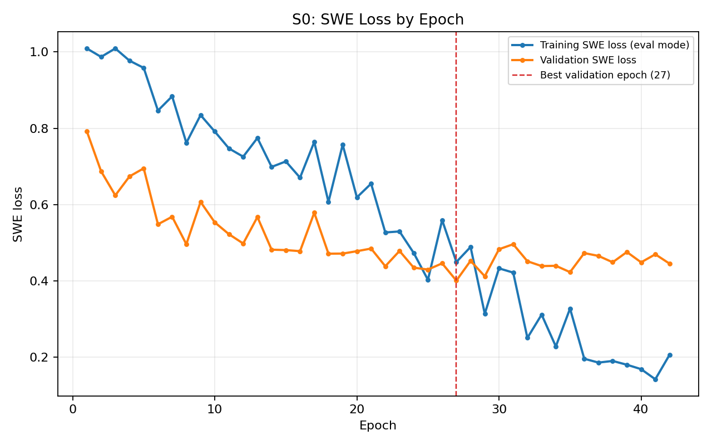
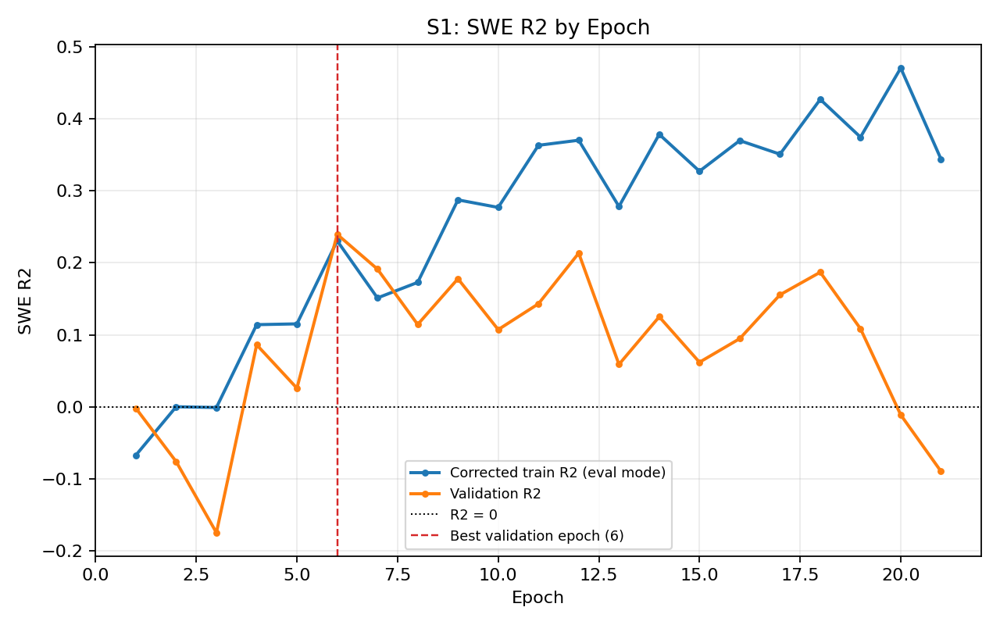
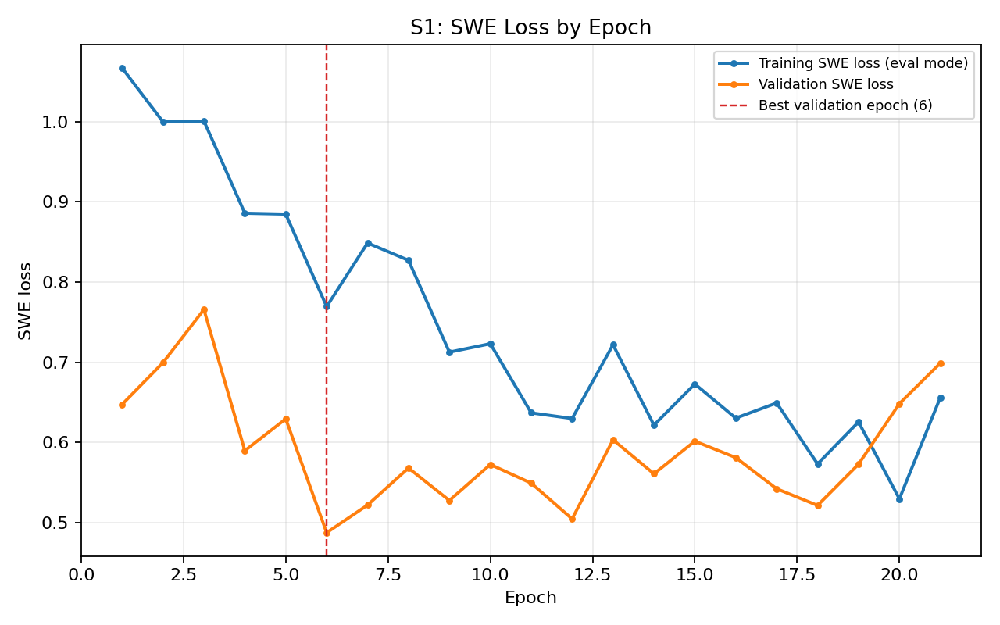
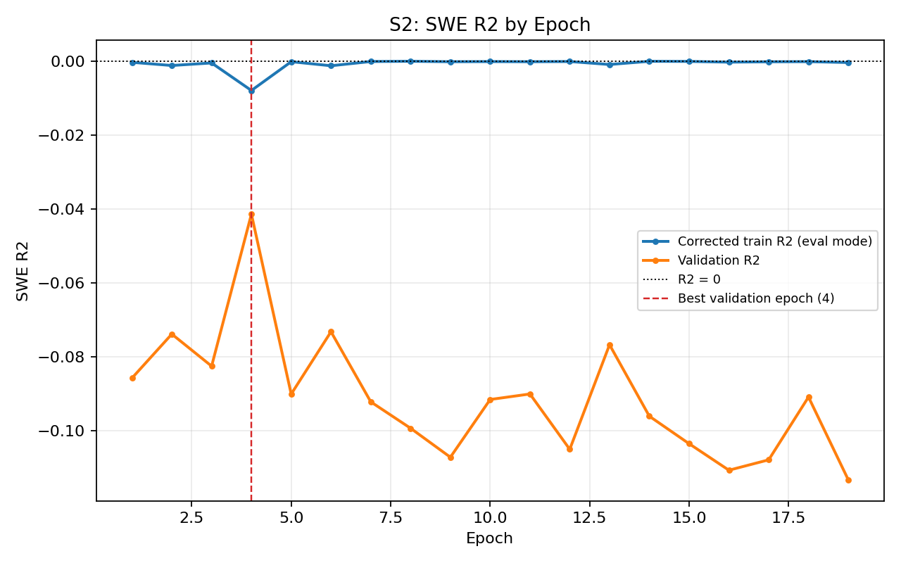
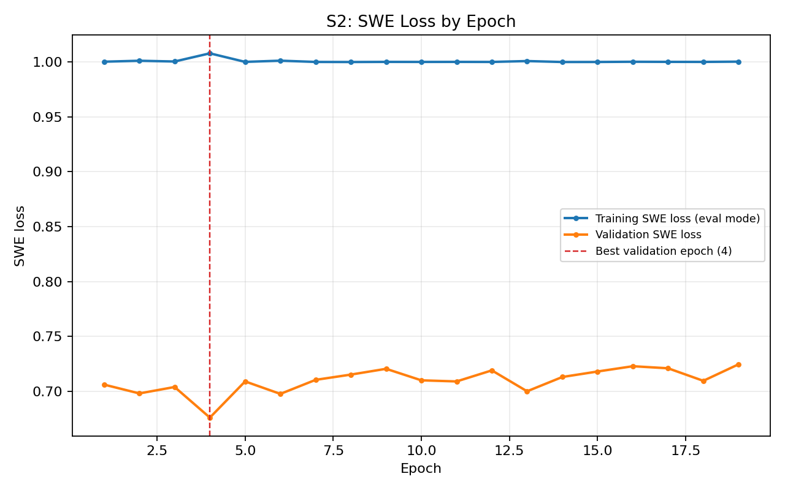
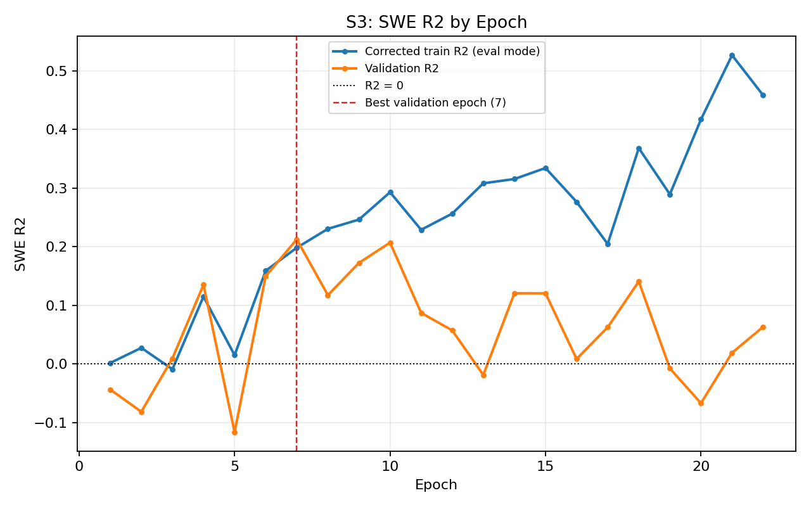
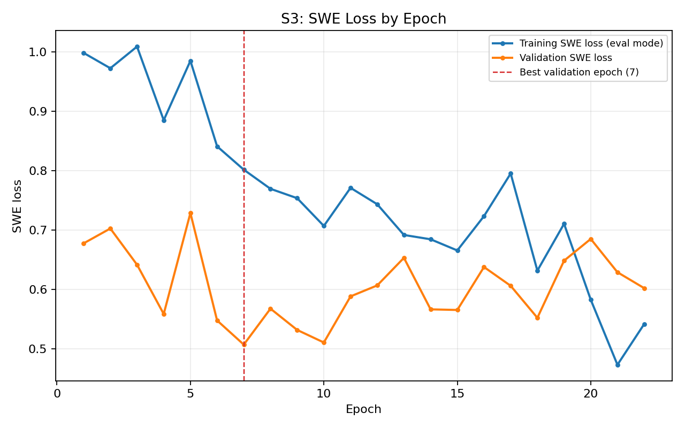

# CPM and AQM Validation Summary: Do the 4 WUS-D3 Driving GCMs Capture These Patterns?

## Purpose

Z1/Z2 (the Pacific SST predictors) are statistically associated with the California
Precipitation Mode (CPM). K5's AMV_PC2_Feb component is associated with the Atlantic
Quadpole Mode (AQM). Before trusting these predictors' relationships in a sim-to-obs
transfer setting, we checked whether the 4 GCMs driving WUS-D3 (EC-Earth3, MIROC6,
MPI-ESM1-2-HR, TaiESM1) actually reproduce these two patterns in their own simulated
SST/circulation.

## 1. CPM (Pacific side)

**Method:** cross-referenced against two existing published sources rather than
recomputing from scratch.

- **Chen et al. (2021, JGR-Atmospheres)** directly analyzed 18 CMIP6 models' own 3rd
  Z500 EOF (their Table 1), reporting each model's correlation with California
  wet-season precipitation and its spatial pattern correlation against ERA-Interim's
  CPM pattern. 3 of our 4 GCMs are in that table.
- **Krantz et al. (2021)**, the CEC memo behind the actual GCM selection for WUS-D3,
  independently scored CPM fidelity (NMSE of the 3rd Z500 EOF vs. ERA5, same domain
  20-75N/90-170W) for all 40 candidate GCMs, including all 4 of ours, as one of ~30
  process-based selection metrics (their Figure 1).

**Results:**

| GCM | Chen et al. (2021) correlation (PC3_pr) | Chen et al. (2021) spatial pattern corr. vs. ERA-Interim | Krantz et al. (2021) CPM NMSE vs. ERA5 |
|---|---|---|---|
| EC-Earth3 | 0.68 | **0.92** | reasonable range (visual read, Fig. 1) |
| MIROC6 | 0.59 | **0.92** | reasonable range (visual read, Fig. 1) |
| MPI-ESM1-2-HR | 0.70 | **0.94** | reasonable range (visual read, Fig. 1) |
| TaiESM1 | not analyzed in this paper (not one of the 18 models) | not available | **~0.3** (reported directly from the figure) |

All correlations in Chen et al.'s table are significant at p<0.05.

**Conclusion:** EC-Earth3, MIROC6, and MPI-ESM1-2-HR have strong, direct, published
evidence of CPM fidelity (0.92-0.94 spatial pattern correlation, well above what would
be needed to call the pattern "captured"). TaiESM1 isn't in Chen et al.'s analyzed set,
so its evidence is one step lower in precision -- a ~0.3 NMSE read from Krantz et al.'s
published selection figure, not a direct spatial correlation number, but the value
itself sits in a reasonable range on that scale. Net result: **all 4 driving GCMs show
evidence of capturing CPM**, three at high confidence from a direct literature number,
one (TaiESM1) at lower precision from a supporting published metric.

## 2. AQM (Atlantic side)

**Method:** the existing project pipeline already reconstructed an AQM reference
pattern from HadISST SST + GPCC precipitation using the Stone et al. (2023) MCA method
-- visually validated against the paper's own Fig. 2a and confirmed to reproduce the
same warm/cool/warm banded structure at the right latitudes. We then reran the identical
MCA method, independently per GCM and scenario (no pooling), using each driving GCM's
own SST (`tos`, global CMIP6 archive) and WUS-D3 d02's own precipitation, for
`historical` (34 water years) and `ssp370` (86 water years) -- 8 runs total, mirroring
how Stone et al. validated their method against a 10,000-year GFDL control simulation.

**Step 3 -- pattern fidelity** (spatial correlation of each GCM's own SST mode-2
against the reference AQM pattern; paper's own GFDL benchmark = 0.59):

| GCM | historical | ssp370 |
|---|---|---|
| EC-Earth3 | 0.31 | 0.33 |
| MIROC6 | **0.67** | 0.40 |
| MPI-ESM1-2-HR | **0.60** | **0.81** |
| TaiESM1 | **0.58** | **0.61** |

3 of 4 GCMs (MIROC6, MPI-ESM1-2-HR, TaiESM1) meet or exceed the paper's own GFDL
benchmark in at least one scenario. EC-Earth3 falls well short in both.

**Step 4 -- does the GCM's own AQM-analog index predict the GCM's own simulated SWE**
(LOYO ridge; real obs baseline: r=0.314, R²=0.097, sign accuracy=0.649):

| GCM/scenario | n | r | R² | sign acc. |
|---|---|---|---|---|
| EC-Earth3 historical | 34 | 0.082 | -0.017 | 0.50 |
| EC-Earth3 ssp370 | 86 | -0.113 | -0.046 | 0.52 |
| MIROC6 historical | 34 | -0.999 | -0.063 | 0.03 |
| MIROC6 ssp370 | 86 | -0.956 | -0.027 | 0.09 |
| MPI-ESM1-2-HR historical | 34 | 0.174 | 0.014 | 0.74 |
| MPI-ESM1-2-HR ssp370 | 86 | **0.472** | **0.221** | 0.66 |
| TaiESM1 historical | 34 | 0.051 | -0.044 | 0.65 |
| TaiESM1 ssp370 | 86 | -0.536 | -0.041 | 0.30 |

**Conclusion:** MPI-ESM1-2-HR is the clearest success -- good pattern fidelity in both
scenarios *and* real predictive skill on its own simulated SWE (ssp370 R²=0.221 actually
exceeds the real-world baseline). EC-Earth3 is a consistent negative result across two
independent tests -- weak pattern fidelity and no SWE relationship, agreeing with each
other. TaiESM1 shows good pattern fidelity but weak/inconsistent SWE predictability
across the two scenarios. **MIROC6 is questionable**: despite good pattern fidelity
(0.67), its Step 4 result (r=-0.999 in both scenarios) is statistically implausible for
34-86 independent held-out years and is far more likely a pipeline artifact -- most
plausibly an inconsistently-applied detrending step, or a shared trend between the
SST-side index and the SWE target that wasn't properly removed in this reimplementation
-- than a genuine physical relationship. This has not yet been debugged/confirmed, so
MIROC6's Step 4 number should currently be treated as **unresolved, not as evidence
either for or against** SWE predictability.

## Overall

- **CPM**: all 4 driving GCMs show evidence of capturing the pattern (3 at high
  confidence via direct literature numbers, 1 at lower confidence via a supporting
  published metric).
- **AQM**: 3 of 4 (MIROC6, MPI-ESM1-2-HR, TaiESM1) show pattern fidelity meeting or
  exceeding the paper's own validation benchmark; EC-Earth3 does not, consistently
  across two independent checks. Of those 3, only MPI-ESM1-2-HR currently shows both
  pattern fidelity *and* confirmed SWE predictability -- MIROC6's predictability result
  needs debugging before it can be trusted, and TaiESM1's is inconsistent across
  scenarios.


# Baseline Model

## First Trial without CPM & AQM head

| Model | SWE head | Best epoch | Train R² | Val R² | R² gap | Train loss | Val loss | Val RMSE | Val MAE | Val r | Interpretation |
|---|---|---:|---:|---:|---:|---:|---:|---:|---:|---:|---|
| S0 | Flatten + MLP | 27 | 0.426 | 0.375 | 0.051 | 0.574 | 0.401 | 27.07 | 19.15 | 0.623 | healthy fit |
| S1 | Self-attention + flatten + MLP | 6 | 0.101 | 0.240 | -0.139 | 0.899 | 0.487 | 29.87 | 21.81 | 0.496 | early saturation / weaker than baseline |
| S2 | SWE/CLS token | 4 | -0.003 | -0.041 | 0.038 | 1.003 | 0.676 | 34.96 | 28.03 | 0.112 | early saturation |
| S3 | MLP + gated residual attention | 7 | 0.148 | 0.212 | -0.064 | 0.852 | 0.507 | 30.40 | 22.91 | 0.471 | attention branch not contributing |

### Corrected Historical Replay Trajectories

The figures below use the post-epoch eval-mode training metrics from the
historical replay. The dashed red line marks the historical best-validation
epoch. The original table above is retained unchanged.

#### S0 - Flatten + MLP





#### S1 - Self-Attention + Flatten + MLP





#### S2 - SWE/CLS Token





#### S3 - MLP + Gated Residual Attention





| Model | Aux location | SWE val R² | RMSE | MAE | r | Final-Z SWE probe R² | Final-Z CPM probe R² | Final-Z AQM probe R² |
|---|---:|---:|---:|---:|---:|---:|---:|---:|
| `S0` | none | 0.375 | 27.07 | 19.15 | 0.623 | 0.414 | 0.142 | -0.055 |
| `D1` | final `Z` | 0.203 | 30.58 | 23.72 | 0.452 | 0.107 | 0.097 | -0.088 |
| `P1` | final `Z` + PCGrad | 0.219 | 30.27 | 23.62 | 0.493 | 0.228 | -0.060 | -0.087 |
| `P2` | final `Z` + grad similarity | 0.144 | 31.68 | 24.92 | 0.464 | 0.118 | 0.076 | 0.085 |
| `U1` | Stage 2 | 0.361 | 27.38 | 20.09 | 0.603 | 0.269 | 0.019 | -0.069 |

Select `S0` as the baseline here. Below is the detailed implementation of `S0`.

S0 Baseline: Static Month-as-Channel CNN + MLP SWE Head

Each model-year input contains 7 monthly climate states from September through March. Each month has 19 physical climate fields plus 19 validity-mask channels on a common $120 \times 240$ latitude-longitude grid:

$$
X_i \in \mathbb{R}^{7 \times 38 \times 120 \times 240}.
$$

For `S0`, the month and channel dimensions are flattened together:

$$
X_i \rightarrow X_i' \in \mathbb{R}^{266 \times 120 \times 240},
\qquad 266 = 7 \times 38.
$$

Each (month, variable) combination therefore becomes its own CNN input channel.

The encoder is a small 2-D residual CNN operating over latitude and longitude:

```text
Input: [B, 266, 120, 240]
Stem:
Conv2d(266 -> 32, kernel=5, stride=2, periodic longitude padding)
-> GroupNorm
-> GELU
Stage 1:
2 residual blocks at 32 channels
-> spatial downsampling
Stage 2:
2 residual blocks at 64 channels
-> spatial downsampling
Stage 3:
2 residual blocks at 128 channels
-> spatial downsampling
-> global spatial pooling
-> Linear projection to 128 values
-> reshape to Z [B, 8, 16]
```

Each residual block uses convolution, GroupNorm, GELU, a second convolution and GroupNorm, together with a residual skip connection. When spatial resolution or channel count changes, the skip path is projected so the tensors have compatible dimensions.

The encoder produces

$$
Z_i \in \mathbb{R}^{8 \times 16},
$$

with 8 learned latent vectors of dimension 16.

SWE Head

The latent representation is flattened:

$$
Z_i \in \mathbb{R}^{8 \times 16}
\rightarrow
\operatorname{vec}(Z_i) \in \mathbb{R}^{128}.
$$

The SWE prediction head is:

$$
128
\rightarrow \operatorname{Linear}(128, 64)
\rightarrow \operatorname{GELU}
\rightarrow \operatorname{Linear}(64, 1)
\rightarrow \widehat{\mathrm{SWE}}
$$

SWE Target and Loss

The target for each model-year is one scalar:

$$
\mathrm{SWE}_i^{\mathrm{label}}
=
\text{April-1 area-weighted Sierra Nevada SWE derived from WUS-D3 d02}.
$$

The SWE target is standardized using statistics computed from the training subset:

$$
y_i =
\frac{\mathrm{SWE}_i^{\mathrm{label}} - \mu_{\mathrm{train}}}
{\sigma_{\mathrm{train}}}.
$$

Training minimizes mean squared error:

$$
L_{\mathrm{SWE}}
=
\frac{1}{N}
\sum_i
(\hat{y}_i - y_i)^2.
$$

For evaluation, predictions are converted back to physical SWE units:

$$
\widehat{\mathrm{SWE}}_i
=
\hat{y}_i \sigma_{\mathrm{train}} + \mu_{\mathrm{train}}.
$$

Evaluation metrics are RMSE, MAE, R^2, and Pearson correlation r.

Train/Validation Split

The available model-year samples are split approximately:

$$
80\% \ \text{training}, \qquad 20\% \ \text{validation}.
$$

The split is grouped by water year:

$$
\boxed{\text{all samples belonging to the same water year stay in the same partition}}
$$

so a given water year does not appear in both training and validation through different GCMs.

The same fixed split is used throughout the architecture comparisons.

Input Standardization

Climate predictors are standardized using training-set statistics independently for each exact

$$
(\text{variable}, \text{month}, \text{latitude}, \text{longitude})
$$

feature column.

For each feature:

$$
X^{\mathrm{std}}
=
\frac{X - \mu_{\mathrm{train}}}
{\sigma_{\mathrm{train}}}.
$$

The same training-derived statistics are then applied to validation data.

Missing physical values are represented by validity-mask channels. Standardized missing values entering the CNN are set to numerical zero, while the corresponding validity mask indicates whether each value is physically defined.

Overall:

$$
\boxed{
[7, 38, 120, 240]
\rightarrow
[266, 120, 240]
\rightarrow
\text{2-D ResCNN}
\rightarrow
Z[8, 16]
\rightarrow
\text{flatten}
\rightarrow
\text{MLP}
\rightarrow
\widehat{\mathrm{SWE}}
}
$$

with an approximately 80/20 grouped train/validation split and SWE MSE training.


| Model | Simulation Pearson \(r\) | Observational Pearson \(r\) | Obs wet/dry accuracy |
|---|---:|---:|---:|
| S0 | 0.499 | 0.153 | 0.486 |
| Frozen S0 + attention | 0.525 | 0.159 | **0.622** |
| End-to-end attention | **0.593** | 0.011 | 0.595 |

## Where we stand now

There isn't one model that wins every metric.

For direct observational SWE-percentile trend, our best model so far is:

$
\boxed{\text{S0 + CPM@Z}}
$

with Pearson

$
r = 0.343.
$

For wet/dry classification among the original attention comparison, frozen S0 + attention reached:

$
\boxed{62.2\%}
$

and remains slightly higher than CPM+AQM's \(59.5\%\).

For the quality of the learned large-scale SWE-relevant representation, the best result so far is:

$
\boxed{\text{S0 + CPM@Z + AQM@Z}}
$

because its latent-based observational retrieval reaches $r = 0.341$, far above plain S0.

So the architecture conclusion at this stage is:

$$
\boxed{
\text{CNN encoder}
\rightarrow
Z
\begin{cases}
\rightarrow \text{SWE percentile} \\
\rightarrow \text{CPM} \\
\rightarrow \text{AQM}
\end{cases}
}
$$

with CPM/AQM attached at final \(Z\).

If attention is used, our evidence favors treating it as a later readout/adaptation mechanism rather than letting it freely reorganize the encoder before we have a sufficiently robust representation.

This experiment gives us a fairly clean architecture conclusion for the seasonal branch.

The strongest overall transfer configuration is now:

\[
\boxed{
\text{CPM+AQM-informed CNN encoder}
\rightarrow
\text{freeze encoder}
\rightarrow
\text{attention}
\rightarrow
\text{SWE percentile}
}
\]

It reaches observational Pearson \(r=0.344\), wet/dry accuracy \(62.2\%\), and keeps the latent-retrieval/CPM-AQM geometry essentially unchanged from the CPM+AQM encoder. So attention **can help**, but mainly as a downstream readout of an already useful representation.

The partial-unfreeze model gives the strongest categorical result:

\[
\boxed{\text{wet/dry accuracy}=64.9\%}
\]

but its Pearson/Spearman and geometry are slightly worse than frozen attention. So partial adaptation may be useful if the final objective is explicitly wet-vs-dry classification, but it is not the strongest choice for preserving the continuous observational trend.

The fully end-to-end model gives the clearest negative result:

\[
r_{\rm obs}: 0.344\rightarrow0.184
\]

when the whole encoder is reopened. That supports the interpretation that the CPM/AQM-informed representation is valuable and that unrestricted downstream SWE optimization can overwrite some of that transferable structure.

There is one implementation detail I would check before treating the partial-unfreeze experiment as completely final. The report says its trainable scope was:

> `down2, stage3, project, attention, swe_head, cpm_head, aqm_head`

whereas our intended experiment was specifically **Stage3 + final projection**, with Stage2 and everything before it protected. If `down2` is the transition module between Stage2 and Stage3, allowing it to train gives the partial model slightly more freedom than we originally specified. It does not invalidate the result, but Claude should document exactly what `down2` contains and whether we conceptually regard it as part of Stage3.

The other thing I would change in Claude's wording is “frozen attention is never worse.” It is slightly worse than the baseline in Spearman:

$$
0.338 < 0.345.
$$

The differences are tiny, so the fair statement is that frozen attention is **roughly tied on rank/geometry, modestly better on Pearson and wet/dry accuracy**.

For our broader project, this tells us how the seasonal branch should eventually interact with the short-timescale representation:

$$
\text{short-term physical pretraining}
\rightarrow
\text{seasonal CPM/AQM-informed encoder}
\rightarrow
\boxed{\text{protected representation}}
\rightarrow
\text{attention/readout}.
$$

In other words, attention is looking much more useful as a **consumer of a good representation** than as the mechanism responsible for creating that representation.